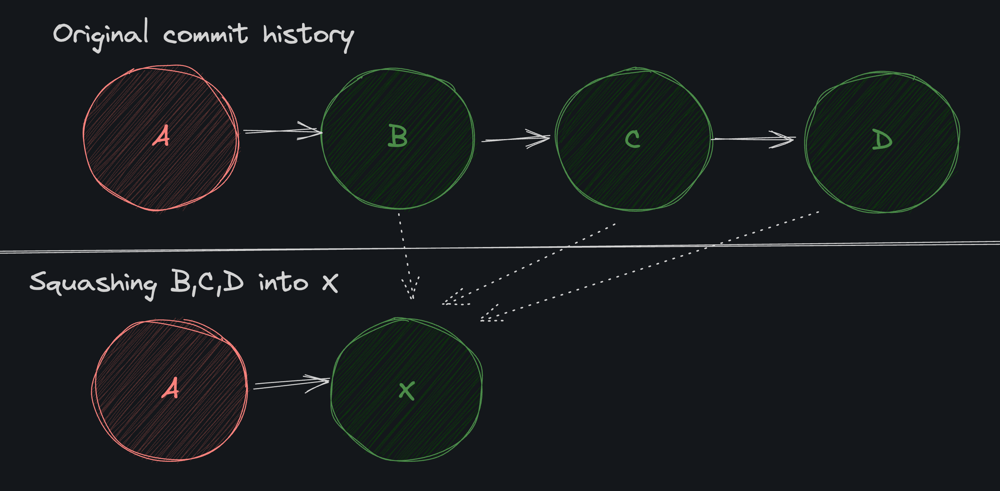
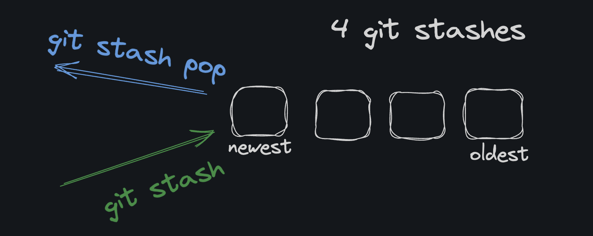
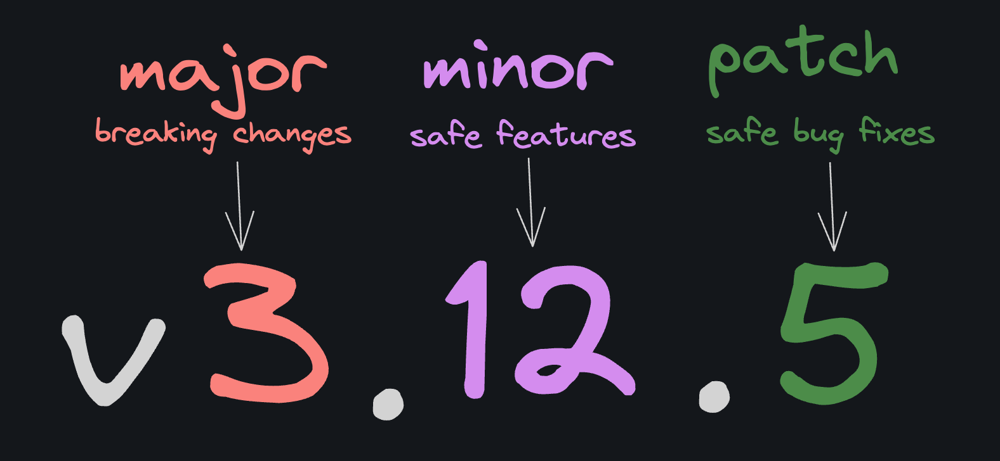

# CH-1 (FORK)
- https://youtu.be/GfdhCaLy8rM
- A fork is a copy of a repository. Forking a repository allows you to freely experiment with changes without affecting the original project.

## Why Fork?

Forking is not a Git operation, but it is a feature offered by many Git hosting services such as GitHub, GitLab, and Bitbucket.

Those services "fork" a repo by creating a new copy of the repo and associating it as a "fork" of the original. It's quite literally just a copy that is linked to the original via some metadata.


## PRs From a Fork
When you fork someone's repository on a platform like GitHub, you get a copy of the repository in your account. This is the standard way to contribute to someone else's open-source project. The steps are typically:
```
Fork their repo into your account
Clone your fork to your local machine
Create a new branch (let's call it your_feature)
Make changes
Commit and push changes to your fork's remote your_feature branch
Create a pull request to original_owner/repo main from your_username/repo your_feature
```
Then the original owner can review your changes. If they like them, they can merge the changes straight from your fork into their repository.

- https://youtu.be/rxh6MhK6Tbs

# CH- 2 (REFLOG)

basically log sirf commit ki jankari deta hai , agar commit humne delete kr diya to ```git log ``` humein sirf , jo bachee hue commit hein unki jankari dega , but humein jo commit delete hogye wo kese pta chlenge
hum ```git reflog ``` se jahan jahan head rha hai uski jaankari lelenge .

The git reflog command (pronounced ref-log, not re-flog) is kinda like git log but stands for "reference log" and specifically logs the changes to a "reference" that have happened over time.

Reflog uses a different format to show the history of a branch or HEAD: one that's more concerned with the number of steps back in time

## Merge
Using Git internals is exceptionally inconvenient. We had to copy/paste and use the cat-file command 3 times!

I would not recommend doing it that way, but I wanted to drive home the point that you can always drop down to the plumbing commands if needed.

Luckily, there is a better way. The git merge command actually takes a "commitish" as an argument:
```
git merge <commitish>
```
A "commitish" is something that looks like a commit (branch, tag, commit, HEAD@{1})

In other words instead of:
```
git reflog (find the commit sha at HEAD@{1})
git cat-file -p <commit sha>
git cat-file -p <tree sha>
git cat-file -p <blob sha>
git add .
git commit -m "B: recovery"
```
We could have just done:
```
git merge HEAD@{1}
```


# CH-3 (MERGE CONFLICTS)

Working with Git is a dream when all of the developers on a project are committing changes to different lines of code. Things get a little hairy when changes to the same lines are made at the same time (e.g. one commit isn't the parent of another).

A merge conflict occurs when two commits modify the same line and Git can't automatically decide which change to keep and which change to discard.

If we merge feature into main, Git will detect that the return line was changed in both branches independently: which creates a conflict.

When a conflict happens (usually as the result of a merge or rebase) Git will prompt you to manually decide which change to keep. It's okay when the same line is modified in one commit, and then again in a later commit. The problem arises when the same line is modified in two commits that aren't in a parent-child relationship.

Conflicting changes on two different branches is not a problem. The problem only arises when you try to merge those branches. When you do, Git will detect the conflict and ask you to resolve it.

## Edit the file
Resolving conflicts is a manual process. When they happen, Git marks the conflicted files and asks you to resolve the conflict by editing the files in your editor.

```
abcde
<<<<<<< HEAD
fgh
=======
ijk
>>>>>>> main
```
fgh wala apna commit hai ......aur ijk wala dusra ka commit 

Your editor might even highlight the conflict markers to make it easier to see, but at the end of the day, it's just text. The top section, between the ```<<<<<<< HEAD``` and ```======= ```lines, is our branch's version of the file. The bottom section, between the ```=======``` and ```>>>>>>>``` main lines, is the version of the file that's on the main branch ("theirs" or as I say "Stupid Greg's").

In many cases, you might want to keep one change and discard the other. That's common when you're dealing with code changes. In this case, we're dealing with content, so we want to keep both changes.

## RESOLUTION
After manually editing any conflicting files (sometimes it's more than one file or more than one section of a file) you need to simply add and commit the changes. This tells Git that you've resolved the conflict and it can continue with the merge.

Note: Git will let you commit conflict markers, so check you removed them all before you continue with a merge.


## Ours and Theirs
In a merge conflict:
- ```Ours ```refers to the branch you are on (merging into)
- ```Theirs``` refers to the branch being merged
```
# you're on the "ours" branch, the "theirs" branch is "their_branch"
git merge their_branch
```

##  Checkout Conflict
We've manually edited files to resolve conflicts, but it turns out Git has some built-in tools to help us out.

The git checkout command can checkout the individual changes during a merge conflict using the --theirs or --ours flags.

- --ours will overwrite the file with the changes from the branch you are currently on and merging into
- --theirs will overwrite the file with the changes from the branch you are merging into the current branch
 ```
git checkout --theirs path/to/file
```

# CH- 4 (REBASE CONFLICTS)

Full disclosure: a lot of rebase's bad rep comes from conflicts! Fear not. It's nothing you can't handle with just a smidge of practice.

Rebasing feels scarier because it rewrites Git history, which means if you're not careful, you can lose work in an unrecoverable way. But as long as you understand what's going on, it will make your (and your team's) Git history cleaner and easier to understand.

In the "real world," what happens most often is:
```
You switch to a new branch, say fix_bug, which is a copy of main.
While you're fixing the bug, someone else merges their changes into main.
You fix the bug, and it so happens that you edited the same files (and lines) that the other person did.
You open a Pull Request to merge (or rebase) fix_bug into main, then Git tells you there's a conflict.
You resolve the conflict on your branch.
You complete the Pull Request with the conflict resolved.
```

The same git checkout --theirs and git checkout --ours commands we used with merge can be used to resolve conflicts during a rebase.

"Accept incoming change" is the same as git checkout --theirs, and "Accept current change" is the same as git checkout --ours.


## Repeat Resolution Setup
A common complaint about rebase is that there are times when you may have to manually resolve the same conflicts over and over again. This is especially prevalent when you have a long-running feature branch, or even more likely, multiple feature branches that are being rebased onto main.

### RERERE to the Rescue
- https://youtu.be/k-4zAoQHKcY?si=LvZbUCn7WV46ZlG9
- The git rerere functionality is a bit of a hidden feature. The name stands for “reuse recorded resolution” and, as the name implies, it allows you to ask Git to remember how you’ve resolved a hunk conflict so that the next time it sees the same conflict, Git can resolve it for you automatically.

In other words, if enabled, rerere will remember how you resolved a conflict (applies to rebasing but also merging) and will automatically apply that resolution the next time it sees the same conflict. Pretty neat, right?


# CH-5 (SQUASH)
Every dev team will have different standards and opinions on how to use Git. Some teams require all pull requests to contain a single commit, while others prefer to see a series of small, focused commits.
If you join a team that prefers a single commit, you will need to know how to "squash" your commits together. To be fair, even if you don't need a single commit, squashing is useful to keep your commit history clean.



## How to Squash
Perhaps confusingly, squashing is done with the git rebase command! Here are the steps to squash the last n commits:

-  Start an interactive rebase with the command git rebase -i HEAD~n, where n is the number of commits you want to squash.
-  Git will open your default editor with a list of commits. Change the word pick to squash for all but the first commit.
-  Save and close the editor.
The -i flag stands for "interactive," and it allows us to edit the commit history before Git applies the changes. HEAD~n is how we reference the last n commits. HEAD points to the current commit (as long as we're in a clean state) and ~n means "n commits before HEAD."

## Why does rebase squash?
Remember, rebase is all about replaying changes. When we rebase onto a specific commit (HEAD~n), we're telling Git to replay all the changes from the current branch on top of that commit. Then we use the interactive flag to "squash" those changes so that Rebase will apply them all in a single commit.

## Force Push
So we did some naughty stuff. We squashed main which means that because our remote main branch on GitHub has commits that we removed, git won't allow us to push our changes because they're totally out of sync.

The git push command has a --force flag that allows us to overwrite the remote branch with our local branch. It's a very dangerous (but useful) flag that overrides the safeguards and just says "make that branch the same as this branch."
```
git push origin main --force
```

## Squashing PR
So we did a weird thing (squash commits on main), now let's do the common thing: squash all the commits on a feature branch for a pull request. If your team prefers single-commit-pull-requests, this will likely be your workflow:
```
Create a new branch off of main.
Go about your work on the feature branch making commits as you go.
When you're ready to get your code into main, squash all your commits into a single commit.
Push your branch to the remote repository.
Open a pull request from the feature branch into main.
Merge the pull request once it's approved.
```


# Ch-6 (STASH)

Git Stash
The git stash command records the current state of your working directory and the index (staging area). It's kinda like your computer's copy/paste clipboard. It records those changes in a safe place and reverts the working directory to match the HEAD commit (the last commit on your current branch).

To stash your current changes and revert the working directory to match HEAD:
```
git stash
```
To list your stashes:
```
git stash list
```

https://youtu.be/_02z3tvMr4I

## POP

```
git stash
git stash pop
git stash list
```

The pop command will (by default) apply your most recent stash entry to your working directory and remove it from the stash list. It effectively undoes the git stash command. It gets you back to where you were.

## What is the Stash
The git stash command stores your changes in a stack (FILO) data structure. That means that when you retrieve your changes from the stash, you'll always get the most recent changes first.
```
# 'git stash' pushes a change onto the stash
git stash
```
```
# 'git stash pop' pops a change off the stash
# and applies it to the working directory
git stash pop
```

https://youtu.be/zSbF3xmSrMg




A "stash" is a collection of changes that you've not yet committed. They might just be "raw" working directory changes, or they might be staged changes. Both can be stashed. So, for example, you can:
```
Make some changes to your working directory
Stage those changes
Make some more changes without staging them
Stash all of that
```
When you do, the "stash entry" will contain both the staged and unstaged changes and both your working directory and index will be reverted to the state of the last commit. It's a very convenient way to "pause" your work and come back to it later.


## Multiple Stashes
possible but not recommended


## Pop Again
Now that you've solved the CEO's problem, time to get back to your own work. Here are a few more useful options when it comes to git stash.

## Apply Without Removing From Stash
This will apply the most recent stash changes, just like pop, but it will keep the stash in the stash list.
```
git stash apply
```
## Remove a Stash Without Applying
This will remove the most recent stash from the stash list without applying it to your working directory.
```
git stash drop
```

## Reference a Specific Stash
Most stash commands allow you to reference a specific stash by its index.
```
# Apply the third (0, 1, 2) most recent stash
git stash apply stash@{2}

# Remove the third most recent stash
git stash drop stash@{2}
```


# CH - 7 (REVERT)
Where git reset is a sledgehammer, git revert is a scalpel.

A revert is effectively an anti commit. It does not remove the commit (like reset), but instead creates a new commit that does the exact opposite of the commit being reverted. It undoes the change but keeps a full history of the change and its undoing.

basically git reset ka fayada with git history


## Using Revert
To revert a commit, you need to know the commit hash of the commit you want to revert. You can find this hash using git log.
```
git log
```
Once you have the hash, you can revert the commit using git revert.
```
git revert <commit-hash>
```

## DIFF
linux ki command bhi hai yai

The git diff command shows you the differences between... stuff. Differences between commits, the working tree, etc.

I frequently use it to look at the changes between the current state of my code and the last commit. For example:
```
# show the changes between the working tree and the last commit
git diff
```
```
# show the differences between the previous commit and the current state, including the last commit and uncommitted changes
git diff HEAD~1
```
```
# show the change between two commits
git diff COMMIT_HASH_1 COMMIT_HASH_2
```

## Revert vs Reset
```
git reset --soft: Undo commits but keep changes staged
git reset --hard: Undo commits and discard changes
git revert: Create a new commit that undoes a previous commit
```
## When to reset
If you're working on your own branch, and you're just undoing something you've already committed, say you're cleaning everything up so you can open a pull request, then git reset is probably what you want.

## When to revert
However, if you want to undo a change that's already on a shared branch (especially if it's an older change), then git revert is the safer option. It won't rewrite any history, and therefore won't step on your coworkers' toes.

https://youtu.be/iIaM7j3tMuk


# CH -8 (CHERY PICK)

There comes a time in every developer's life when you want to yoink a commit from a branch, but you don't want to merge or rebase because you don't want all the commits.

The git cherry-pick command solves this.
```
git cherry-pick <commit-hash>
```

## How to cherry pick

- First, you need a clean working tree (no uncommitted changes).
- Identify the commit you want to cherry-pick, typically by git loging the branch it's on.
Run:
```
git cherry-pick <commit-hash>
```


# CH-9 (BISECT)
https://youtu.be/pEew75MjiG8

basically bug dhundne ke liye binarynsearch ki jaa rhi hai

So we know how to fix problems in our code. We can either:

Revert the commit with the bug (this is more common on large teams)
"Fail forward" by just writing a new commit that fixes the bug (this is more common on small teams)
But there's another question:
```
How do we find out when a bug was introduced?
```

That's where the git bisect command comes in. Instead of manually checking all the commits (O(n) for Big O nerds), git bisect allows us to do a binary search (O(log n) for Big O nerds) to find the commit that introduced the bug.

For example, if you have 100 commits that might contain the bug, with git bisect you only need to check 7 commits to find the one that introduced the bug.

## How to Bisect
There are effectively 7 steps to bisecting:
```
Start the bisect with git bisect start
Select a "good" commit with git bisect good <commitish> (a commit where you're sure the bug wasn't present)
Select a bad commit via git bisect bad <commitish> (a commit where you're sure the bug was present)
Git will checkout a commit between the good and bad commits for you to test to see if the bug is present
Execute git bisect good or git bisect bad to say the current commit is good or bad
Loop back to step 4 (until git bisect completes)
Exit the bisect mode with git bisect reset
```


# Ch-10 (WorkTrees)

Worktrees
We've been saying "worktree" all throughout this course but I've been misusing it... I am sorry :(

I've been saying "worktree" when I meant "main worktree", which is more precise because you can have more than one working tree.

What is a worktree?
A worktree (or "working tree" or "working directory") is just the directory on your filesystem where the code you're tracking with Git lives. Usually, it's just the root of your Git repo (where the .git directory is). It contains:
```
Tracked files (files that Git knows about)
Untracked files (files that Git doesn't know about)
Modified files (files that Git knows about that have been changed since the last commit)
```
The worktree command
Git has the git worktree command that allows us to work with worktrees. The first subcommand we'll worry about is simple:
```
git worktree list
```
It lists all the worktrees you created.

## Linked Worktrees
We've talked about:

- Stash (temporary storage for changes)
- Branches (parallel lines of development)
- Clone (copying an entire repo)
Worktrees accomplish a similar goal (allow you to work on different changes without losing work), but are particularly useful when:

- You want to switch back and forth between the two change sets without having to run a bunch of git commands (not branches or stash)
- You want to keep a light footprint on your machine that's still connected to the main repo (not clone)
## The main worktree
- Contains the .git directory with the entire state of the repo
- Heavy (lots of data in there!). To get a new main working tree requires a git clone or git init
## A linked worktree
- Contains a .git file with a path to the main working tree
- Light (essentially no data in there!), about as light as a branch
- Can be complicated to work with when it comes to env files and secrets
## Create a linked worktree
To create a new worktree at a given path:
```
git worktree add <path> [<branch>]
```
## No Duplicate Branches
Linked worktrees behave just like a "normal" git repo. You can create new branches, switch branches, delete branches, create tags, etc etc.

BUT there is one thing you cannot do... you cannot work on a branch that is currently checked out by any other working tree (main or linked).

## Tracking
So how does your main worktree know about your linked worktree? Well, the references are stored in the .git/worktrees directory!

## Upstream
When you make a change in a linked worktree, that change is automatically reflected in the main worktree!

It makes sense: the linked worktree doesn't have a .git directory, so it's not a separate repository. It's just a different view of the same repository.

You can almost think of a linked worktree as just another branch in the same repo, but with its own space on the filesystem.

## Delete Worktrees
You may never need to stash again! Okay, stash is still useful for tiny stuff, but worktrees are so much better for long-lived changes.

However, at some point you will need to clean up your worktrees. The simplest way is the remove subcommand:
```
git worktree remove WORKTREE_NAME
```
An alternative is to delete the directory manually, then prune all the worktrees (removing the references to deleted directories):
```
git worktree prune
```

# CH-11 (TAG)
A tag is a name linked to a commit that doesn't move between commits, unlike a branch. Tags can be created and deleted, but not modified.

## How to tag
To list all current tags:
```
git tag
```
To create a tag on the current commit:
```
git tag -a "tag name" -m "tag message"
```

## Semver
It's kinda weird to just name tags any old thing. We're developers, we like structure, sameness, and sometimes even bike-shedding.

"Semver", or "Semantic Versioning", is a naming convention for versioning software. You've probably seen it around, it looks like this:



Note: the "v" isn't technically part of "semver", but it's often there to say "this is a version".

It has two primary purposes:

- To give us a standard convention for versioning software
- To help us understand the impact of a version change and if it's safe (how hard it will be) to upgrade to
Each part is a number that starts at 0 and increments upward forever. The rules are simple:

- MAJOR increments when we make "breaking" changes (this is typically a big release, for example, Python 2 -> Python 3)
- MINOR increments when we add new features in a backward-compatible manner
- PATCH increments when we make backward-compatible bug fixes
To sort them from highest to lowest, you first compare the major versions, then the minor versions, and finally the patch versions. For example, a major version of 2 is always greater than a major version of 1, regardless of the minor and patch versions.

As a special case, major version 0 is typically considered to be pre-release software and thus the rules are more relaxed.
